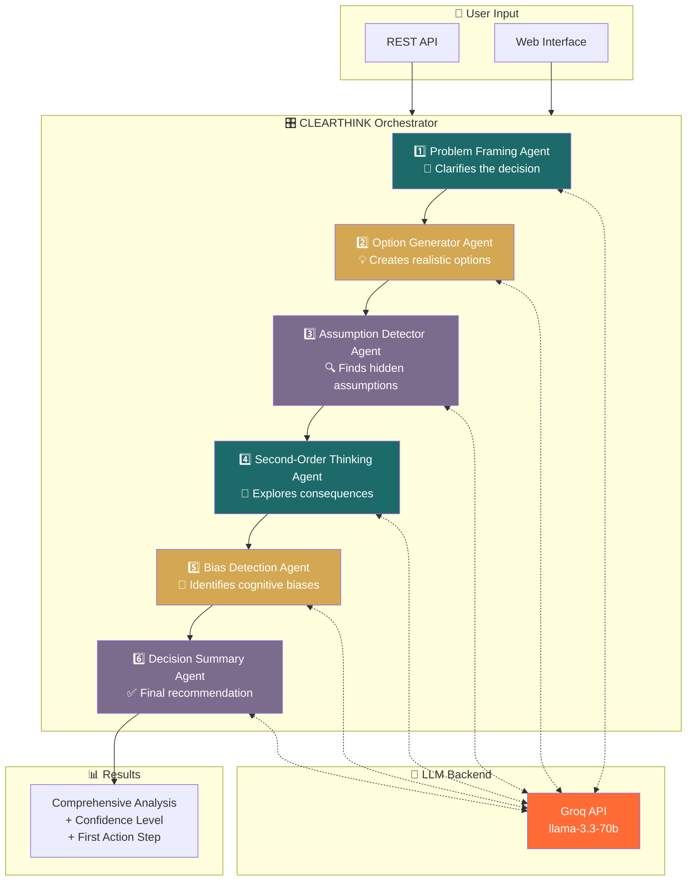

# 🧠 CLEARTHINK

<div align="center">


**Multi-Agent Decision Making System**

*Think clearly, decide wisely.*

[](https://fastapi.tiangolo.com/)
[](https://langchain.com/)
[](https://groq.com/)

</div>

---

CLEARTHINK uses 6 specialized AI agents to help you make better decisions by analyzing problems from multiple perspectives.

## 🏗️ Architecture



## 🧩 How It Works

| # | Agent | What It Does |
|---|-------|--------------|
| 1️⃣ | **Problem Framing** | Transforms messy input into clear problem statements |
| 2️⃣ | **Option Generator** | Generates realistic options with honest trade-offs |
| 3️⃣ | **Assumption Detector** | Finds hidden assumptions (Facts, Beliefs, Fears) 🔥 |
| 4️⃣ | **Second-Order Thinking** | Explores "what happens next" scenarios |
| 5️⃣ | **Bias Detection** | Identifies cognitive biases gently |
| 6️⃣ | **Decision Summary** | Synthesizes recommendations with confidence levels |

## 🚀 Quick Start

```bash
# 1. Navigate to project
cd CLEARTHINK

# 2. Create virtual environment
python -m venv venv

# 3. Activate virtual environment
# Windows:
venv\Scripts\activate
# Mac/Linux:
source venv/bin/activate

# 4. Install dependencies
pip install -r requirements.txt

# 5. Set up environment variables
copy .env.example .env
# Edit .env and add your GROQ_API_KEY

# 6. Run the application
python main.py
```

The app will be available at: http://localhost:8000

## 💡 Example Use Cases

- 💼 Career decisions
- 🚀 Startup ideas
- 💰 Financial choices
- ❤️ Relationship decisions
- 📦 Product decisions

## 🎨 Design

Built with a **Neutral + Earth** color palette:
- Cream `#F5EBE0`
- Teal `#1D6A6A`
- Gold `#D4A853`
- Purple `#7B6B8D`

## 📁 Project Structure

```
CLEARTHINK/
├── app/
│   ├── agents/           # 6 specialized agents
│   │   ├── base.py
│   │   ├── problem_framing.py
│   │   ├── option_generator.py
│   │   ├── assumption_detector.py
│   │   ├── second_order_thinking.py
│   │   ├── bias_detection.py
│   │   ├── decision_summary.py
│   │   └── orchestrator.py
│   ├── main.py           # FastAPI application
│   └── config.py
├── static/
│   ├── index.html
│   ├── styles.css
│   └── app.js
├── main.py               # Entry point
├── requirements.txt
└── .env.example
```

## 🔧 API Endpoints

| Method | Endpoint | Description |
|--------|----------|-------------|
| GET | `/` | Serve UI |
| GET | `/health` | Health check |
| POST | `/api/analyze` | Analyze a decision |
| GET | `/docs` | API documentation |

## 📝 License

MIT
